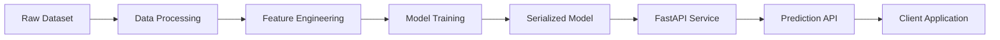
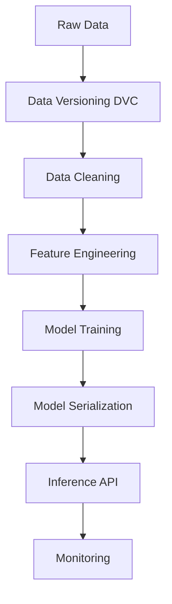

# Rakuten Product Classification — Production-Ready MLOps Pipeline


An end-to-end MLOps pipeline for multimodal e-commerce product classification using text and image data.

This repository demonstrates a production-ready machine learning system, including:
- data versioning
- feature engineering
- model training
- inference pipeline
- REST API
- containerized deployment
- automated testing

The project is based on the Rakuten product classification challenge.

======================================================================
SYSTEM ARCHITECTURE
======================================================================



======================================================================
MLOPS PIPELINE
======================================================================



======================================================================
PROJECT STRUCTURE
======================================================================

.
├── .dvc/                      # Data Version Control configuration
├── data
│   ├── raw                    # Original dataset
│   ├── preprocessed           # Cleaned datasets
│   └── external               # External inference data
│
├── logs                       # Training / inference logs
│
├── models
│   ├── artifacts              # Serialized pipelines
│   │   └── model_final.joblib
│   └── label_mapping.json
│
├── notebooks                  # Exploration and experiments
│
├── src
│   ├── main.py                # Training entrypoint
│   ├── predict.py             # Prediction script
│   │
│   ├── api
│   │   └── main.py            # FastAPI application
│   │
│   ├── data
│   │   ├── import_raw_data.py
│   │   ├── check_structure.py
│   │   └── make_dataset.py
│   │
│   ├── features
│   │   └── build_features.py
│   │
│   ├── models
│   │   └── train_model.py
│   │
│   └── config
│
├── tests
│
├── requirements.txt
└── README.md

======================================================================
INSTALLATION
======================================================================

Clone the repository:

```bash
git clone <repo_url>
cd rakuten-mlops
```

Create the environment:

```bash
conda create -n Rakuten-project python=3.10
conda activate Rakuten-project
```

Install dependencies:

```bash
pip install -r requirements.txt
```

Install DVC Google Drive plugin:

```bash
pip install dvc-gdrive
```

======================================================================
DOWNLOAD MODELS
======================================================================

```bash
dvc pull
```

======================================================================
DATASET SETUP
======================================================================

Download the dataset:
https://challengedata.ens.fr/participants/challenges/35/

Place the images inside:

data/raw
├── image_train
└── image_test

======================================================================
DATA PREPARATION
======================================================================

Run:

```bash
python src/data/make_dataset.py data/raw data/preprocessed
```

This step:
- copies raw data
- generates processed dataset
- prepares training features

======================================================================
MODEL TRAINING
======================================================================

Train the model:

```bash
python src/main.py
```

The trained pipeline will be saved in:

models/artifacts/model_final.joblib

======================================================================
PREDICTION
======================================================================

Run prediction:

```bash
python src/predict.py
```

Example:

```bash
python src/predict.py \
--dataset_path data/preprocessed/X_test_update.csv \
--images_path data/preprocessed/image_test
```

Predictions are stored in:

data/preprocessed/predictions.json

======================================================================
API INFERENCE
======================================================================

The project exposes a FastAPI inference service.

Start the server:

```bash
uvicorn src.api.main:app --host 0.0.0.0 --port 8000 --reload
```

Open documentation:

http://localhost:8000/docs

======================================================================
API ENDPOINTS
======================================================================

Health
------
GET /health

Returns API status.

Predict
-------
POST /predict

Requires authentication:

Authorization: Bearer <token>

Token must be set with:

API_AUTH_TOKEN

======================================================================
EXAMPLE REQUEST
======================================================================

```json
{
  "text": "Console Sony PS5 avec manette DualSense",
  "image_path": "optional/path/to/image.jpg"
}
```

======================================================================
VALIDATION RULES
======================================================================

| Field      | Requirement                      |
|------------|----------------------------------|
| text       | required                         |
| model_type | optional ("lstm" or "vgg16")     |
| image_path | required for image model         |

======================================================================
ERROR HANDLING
======================================================================

| Status | Description          |
|--------|----------------------|
| 422    | validation error     |
| 503    | model not loaded     |
| 500    | internal server error|

======================================================================
TESTING
======================================================================

Run tests:

```bash
pytest
```

Coverage requirement:

90% minimum on src/api

======================================================================
DOCKER DEPLOYMENT
======================================================================

Pull models:

```bash
dvc pull
```

Build image:

```bash
docker build -t rakuten-api .
```

Run container:

```bash
docker run -p 8000:8000 rakuten-api
```

Access API:

http://localhost:8000/docs

======================================================================
CI/CD (RECOMMENDED)
======================================================================

Typical CI pipeline:

GitHub Actions
1. Install dependencies
2. Run linting
3. Run unit tests
4. Validate coverage
5. Build Docker image
6. Push container

Create this file:

.github/workflows/ci.yml

With the following content:

```yaml
name: ML Pipeline CI

on:
  push:
    branches: [ main ]
  pull_request:
    branches: [ main ]

jobs:
  test:
    runs-on: ubuntu-latest

    steps:
      - name: Checkout repository
        uses: actions/checkout@v3

      - name: Setup Python
        uses: actions/setup-python@v4
        with:
          python-version: 3.10

      - name: Install dependencies
        run: |
          pip install -r requirements.txt

      - name: Run tests
        run: |
          pytest

      - name: Check coverage
        run: |
          pytest --cov=src
```

======================================================================
CI BADGE
======================================================================

Add this badge at the top of your README:

```md

```

======================================================================
API DEMO
======================================================================

Add this section to your README:

```md
# API Demo

Example of real-time prediction using the FastAPI interface.


```

To create the GIF:
1. Start the API:
   uvicorn src.api.main:app --reload
2. Open:
   http://localhost:8000/docs
3. Record your screen with:
   - ScreenToGif
   - Kap
   - LiceCap
4. Export the file as:
   demo/api_demo.gif

======================================================================
MACHINE LEARNING ARCHITECTURE
======================================================================



```mermaid
flowchart LR

A[Raw Dataset] --> B[Data Versioning DVC]
B --> C[Data Processing]
C --> D[Feature Engineering]
D --> E[Model Training]
E --> F[Model Serialization]
F --> G[Model Registry / Artifacts]
G --> H[FastAPI Inference Service]
H --> I[Prediction API]
I --> J[Client Application]
```

This diagram shows:
- data management
- training pipeline
- model deployment
- API inference

======================================================================
FUTURE IMPROVEMENTS
======================================================================

Possible enhancements:
- MLflow experiment tracking
- model registry
- drift detection
- monitoring with Prometheus
- distributed training
- GPU inference

======================================================================
PRETRAINED MODELS
======================================================================

Download models:
https://drive.google.com/drive/folders/1fjWd-NKTE-RZxYOOElrkTdOw2fGftf5M

Place them inside:
models/

======================================================================
ADDITIONAL RESOURCES
======================================================================

Drive folder:
https://drive.google.com/drive/folders/1vYf7JAkDylxW53viUhayQODOK_1kuzc9

Dataset:
https://challengedata.ens.fr

Project template:
https://drivendata.github.io/cookiecutter-data-science/

======================================================================
IDEAL FINAL REPOSITORY STRUCTURE
======================================================================

rakuten-mlops
│
├── data
├── models
├── notebooks
├── src
│
├── tests
│
├── demo
│   └── api_demo.gif
│
├── .github
│   └── workflows
│       └── ci.yml
│
├── Dockerfile
├── requirements.txt
├── README.md
└── pytest.ini
